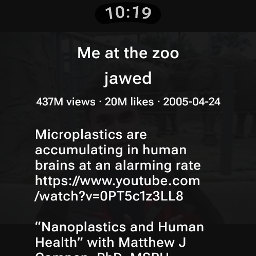

# youtube-wear

YouTube on Wear OS watches. Shorts and regular videos play on the watch itself, resolved by
[yt-dlp](https://github.com/yt-dlp/yt-dlp) running on an embedded CPython
([Chaquopy](https://chaquo.com/chaquopy/)), with [QuickJS-ng](https://github.com/quickjs-ng/quickjs)
solving YouTube's JavaScript challenges and Media3 ExoPlayer playing the streams.
Built and tested on a Samsung Galaxy Watch Ultra.

Not affiliated with YouTube or Google. It uses YouTube's web endpoints the way yt-dlp does,
which YouTube's terms don't allow and which can break whenever YouTube changes them.

<p>




</p>

## Features

- **Reels:** your Shorts feed (personalised when signed in), falling back to subscriptions'
  Shorts, then a search. Swipe between reels; they loop.
- **Videos:** your home feed (YouTube's Most Popular when signed out), Search with the
  watch's keyboard, and Voice search with its speech recognition.
- **Controls:** tap to pause; paused, previous / play / next and volume. The bezel or crown
  also sets the volume. In a regular video, swipe up for its details.
- **Likes:** double-tap a reel to like or unlike it.
- **Bad networks:** Settings has timeouts for likes (8 s) and videos (50 s). Hold a loading
  video until two green dots show, then release, to keep waiting with no timeout.
- A small hidden extra for long loads.

## Installing

Download the APK from [Releases](../../releases) and install it with adb over wireless
debugging (Settings > Developer options > Wireless debugging on the watch):

```
adb pair <ip>:<pairing port>      # once, with the code the watch shows
adb install youtube-wear-<version>.apk
```

## Signing in

Signing in with cookies is not recommended for use.

## Layout

```
app/src/main/java/.../MainActivity.kt   home screen and navigation
app/src/main/java/.../WatchScreens.kt   reels pager, video screen, controls, hold-to-force-load
app/src/main/java/.../WatchSession.kt   what's playing, likes, timeouts
app/src/main/java/.../VideoMenu.kt      home feed and search results
app/src/main/java/.../Playback.kt       ExoPlayer and the resolve / prefetch queue
app/src/main/java/.../YtDlp.kt          Kotlin bridge to ytwear.py
app/src/main/python/ytwear.py           yt-dlp calls: resolve, feeds, search, likes
app/src/main/cpp/quickjs-ng/            QuickJS-ng 0.17.0, built as the qjs executable
.claude/skills/watch-test/              scripts for driving the app on a watch over adb
```

## SDK levels

| Setting | Value | Why |
|---|---|---|
| `targetSdk` | 35 (Android 15) | Google Play minimum for Wear OS apps from Aug 31 2026. |
| `compileSdk` | 37 | Current AndroidX libraries (core-ktx 1.19) require it. Does not change runtime behaviour. |
| `minSdk` | 30 (Wear OS 3, Android 11) | Every watch sold since late 2021, including all Wear OS Galaxy Watches. |

## Building

Install Android SDK Platform 37, Build Tools 36.0.0, NDK 30.0.16248370 and CMake 3.22.1
(Android Studio offers to). Chaquopy needs Python 3.11 on the build machine (`py -3.11` on
Windows, `python3.11` elsewhere, or `buildPython=<path>` in `local.properties`); 3.11 is the
newest Python Chaquopy builds for 32-bit ARM, which many watches run. The Gradle
configuration cache is off because Chaquopy runs Python while configuring.

```
./gradlew :app:assembleDebug
```

Optional `local.properties` entries (the file is not in git):

```
youtubeApiKey=AIza...            # YouTube Data API v3 key, restricted to this app
releaseStoreFile=/path/to/release.jks
releaseStorePassword=...
releaseKeyAlias=...
releaseKeyPassword=...
```

The API key only powers the signed-out Most Popular list and the Shorts search fallback.
Restrict it in Google Cloud to the YouTube Data API and to Android app `ca.wolfietech.dev.android.ytwear`
with your signing certificates' SHA-1; the app sends the matching identity headers.
